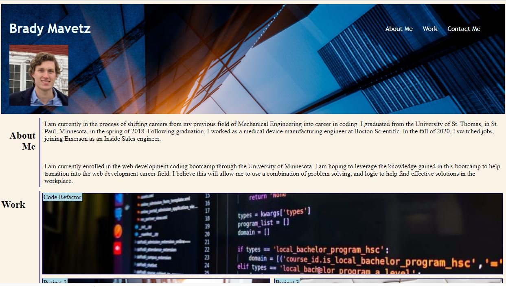

# 02 Advanced CSS: Portfolio

## Project Summary

In this project the goal was to create a Portfolio page from scratch.  No starter code was given, and the web application was to be made from the ground, up. The portfolio page that we are tasked with making is meant to be updated throughout the course, acting as a living space for potential future employers to view the work for employment considerations. 

This page required the following acceptance criteria:


## Acceptance Criteria


```
GIVEN I need to sample a potential employee's previous work
WHEN I load their portfolio
THEN I am presented with the developer's name, a recent photo or avatar, and links to sections about them, their work, and how to contact them
WHEN I click one of the links in the navigation
THEN the UI scrolls to the corresponding section
WHEN I click on the link to the section about their work
THEN the UI scrolls to a section with titled images of the developer's applications
WHEN I am presented with the developer's first application
THEN that application's image should be larger in size than the others
WHEN I click on the images of the applications
THEN I am taken to that deployed application
WHEN I resize the page or view the site on various screens and devices
THEN I am presented with a responsive layout that adapts to my viewport
```


## Web page screenshot and link

The following image shows the upper portion of the portfolio webpage:



The following link will take you to the portfolio webpage:


